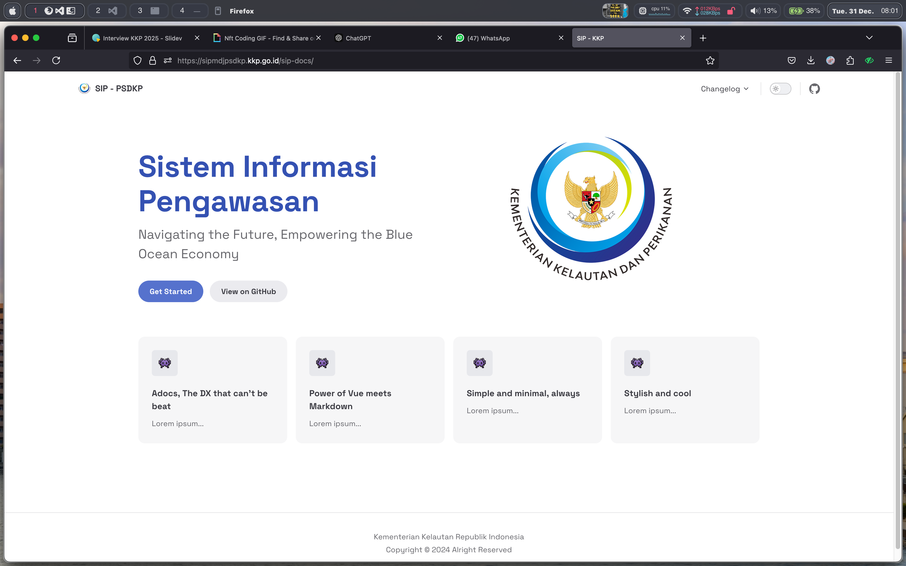
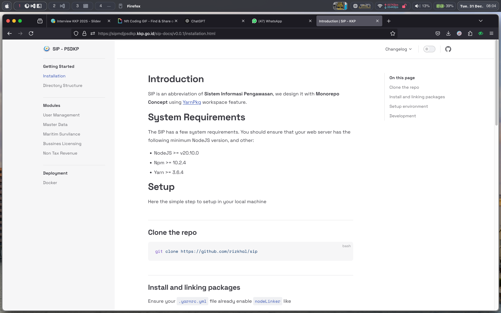

# 2024 Report's

Sistem Informasi Pengawasan (SIP)

  
    Press Space for next page <carbon:arrow-right class="inline"/>
  

---
layout: presenter
twitter: '@rixzkl'

twitterUrl: 'https://twitter.com/rixzkl'
presenterImage: './public/image.png'
---

# Rizkal Lamaau

- Flores, Indonesia
- Web Developer Since 2019
- Mobile Developer Since 2020

---
layout: two-cols
---

  

# Production Ready
- Tanya Data
- Halo PSDKP
- Sadar GAKKUM
- Laporak Kegiatan Usaha
- Pengawasan Berbasis Risiko

::right::

  

---
layout: two-cols
---
 
 

# FrontEnd Documentation

We also write better technical documentation
- How to install
- How to maintenance
- How to backup
- How to deploy
- And how many more

::right::

---
layout: intro
---

# 2025 Plan's

A goal without a plan is just a wish.
 
– Antoine de Saint-Exupéry

---
layout: two-cols

image: './public/mobile/filter.jpeg'
---

 
 

# Vessel Search Enggine

## Search screen
You can filter vessel based on the list below

- Nama Kapal
- No Buku Kapal
- Nama Pemilik
- NIB
- SILAT
- SIMKADA
- eSLO
- DEPHUB

---
layout: two-cols

image: './public/mobile/profile.jpeg'
---

 
 

# Vessel Search Enggine

## Profil
We are integrated with a lot of API like

- OSS
- eSLO
- SILAT
- SIMKADA
- DEPHUB

---
layout: two-cols

image: './public/mobile/trip.jpeg'
---

 
 

# Vessel Search Enggine

## Trip
One of our primary plan is made vessel search enggine. As our anlyzing result, this will help <b>"Pengawas Perikanan"</b> a lot

---
layout: two-cols

image: './public/mobile/foul.jpeg'
---

 
 

# Vessel Search Enggine

## Indication of violation
We also set mark using data from SPKP. That's realtime from SPKP when have violation

---
layout: new-section
class: 'grid text-center align-self-center justify-self-center'
---

# Terima Kasih

[Download PDF](./slidev-exported.pdf)
